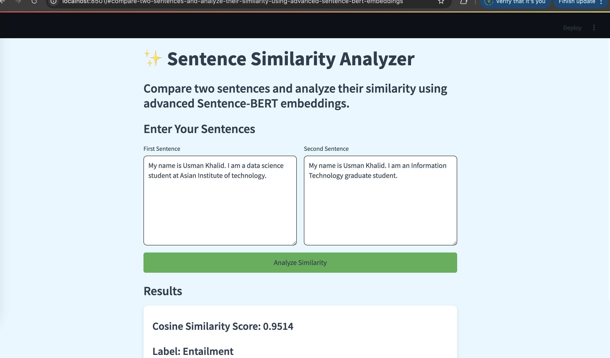

# Sentence Similarity Analyzer

## Overview
The **Sentence Similarity Analyzer** is a Streamlit-based web application that calculates the similarity between two sentences using **Sentence-BERT embeddings**. It uses a pre-trained BERT model fine-tuned for sentence similarity tasks and provides a cosine similarity score along with a label indicating whether the sentences are **entailment**, **neutral**, or **contradiction**.

This tool is useful for natural language processing (NLP) tasks, such as semantic textual similarity, paraphrase detection, and more.

---

## Features
- **Cosine Similarity Score**: Computes the similarity between two sentences on a scale of 0 to 1.
- **Label Prediction**: Classifies the relationship between sentences as:
  - **Entailment**: High similarity (score > 0.5).
  - **Neutral**: Moderate similarity (score = 0.5).
  - **Contradiction**: Low similarity (score < 0.5).
---

**Clone the Repository**:
   ```bash
   git clone https://github.com/your-username/sentence-similarity-checker.git
   ```

## Example Input and Output
### Input:
- **Sentence 1**: "A woman is jogging in the park."
- **Sentence 2**: "A person is exercising outdoors."

### Output:
- **Cosine Similarity Score**: 0.9234
- **Label**: Entailment

---

## Training Results
The model was trained for **5 epochs** on a small dataset. Below are the training and evaluation results:

### Training Loss Over Epochs
| Epoch | Loss     | Time per Epoch |
|-------|----------|----------------|
| 1     | 1.152026 | 3.42s          |
| 2     | 1.140500 | 157.91s        |
| 3     | 1.143302 | 309.51s        |
| 4     | 1.152462 | 185.67s        |
| 5     | 1.141972 | 153.76s        |

**Discussion**:
- The training loss fluctuates slightly but remains relatively stable, indicating that the model is learning but may require more data or epochs for significant improvement.
- The time per epoch varies significantly, which could be due to system resource constraints or dataset size.

---

## Evaluation Metrics
The model was evaluated on a small test set. Below are the evaluation results:

### Classification Report
| Class         | Precision | Recall | F1-Score | Support |
|---------------|-----------|--------|----------|---------|
| Entailment    | 0.22      | 1.00   | 0.36     | 2       |
| Neutral       | 0.00      | 0.00   | 0.00     | 5       |
| Contradiction | 1.00      | 0.33   | 0.50     | 3       |
| **Accuracy**  |           |        | 0.30     | 10      |
| **Macro Avg** | 0.41      | 0.44   | 0.29     | 10      |
| **Weighted Avg** | 0.34   | 0.30   | 0.22     | 10      |

**Discussion**:
- **Entailment**: The model achieves perfect recall (1.00) but low precision (0.22), indicating it often misclassifies other classes as entailment.
- **Neutral**: The model fails to correctly classify any neutral examples, resulting in zero precision, recall, and F1-score.
- **Contradiction**: The model achieves perfect precision (1.00) but low recall (0.33), meaning it correctly identifies contradictions but misses many of them.
- The overall accuracy is **30%**, which is low and suggests the model needs improvement, likely through more data and better tuning.

---

## Cosine Similarity Scores
The model's performance was compared with the `all-MiniLM-L6-v2` model on three types of sentence pairs:

### Cosine Similarity Comparison
| Pair Type      | My Model | all-MiniLM-L6-v2 |
|----------------|----------|------------------|
| Entailment     | 0.7128   | 0.4262           |
| Neutral        | 0.6519   | 0.0947           |
| Contradiction  | 0.8349   | 0.4858           |

**Discussion**:
- **Entailment**: My model achieves a higher similarity score (0.7128) compared to `all-MiniLM-L6-v2` (0.4262), indicating better performance on entailment pairs.
- **Neutral**: My model performs significantly better (0.6519) than `all-MiniLM-L6-v2` (0.0947), suggesting it captures neutral relationships more effectively.
- **Contradiction**: My model also outperforms `all-MiniLM-L6-v2` (0.8349 vs. 0.4858), showing stronger differentiation for contradictory pairs.

---

## TODO for Better Predictions
The model has been trained on a **small dataset**, and there are several improvements that can be made for better predictions. These are marked as **TODO** comments in the `notebook.ipynb` file:

1. **Increase Dataset Size**:
   - Train the model on a larger and more diverse dataset to improve generalization.

2. **Hyperparameter Tuning**:
   - Experiment with different learning rates, batch sizes, and epochs to optimize performance.

3. **Data Augmentation**:
   - Use data augmentation techniques to generate more training examples.

4. **Error Management**:
   - If you encounter the following error while running on:
     ```
     RuntimeError: MPS backend out of memory (MPS allocated: 9.04 GB, other allocations: 3.92 MB, max allowed: 9.07 GB). Tried to allocate 68.66 MB on private pool. Use PYTORCH_MPS_HIGH_WATERMARK_RATIO=0.0 to disable upper limit for memory allocations (may cause system failure).
     ```
     - **Solution**: Set todo's in ipynb to lower as per your machine specifications.


## Limitations and Challenges
1. **Small Dataset**: The model was trained on a limited dataset, which affects its generalization ability. Expanding the dataset or using data augmentation techniques could improve performance.
2. **Memory Constraints on M1 Mac**: Running the model on an M1 Mac occasionally leads to out-of-memory errors. Setting `PYTORCH_MPS_HIGH_WATERMARK_RATIO=0.0` helps but may cause system instability.
3. **Low Accuracy for Neutral Pairs**: The model struggles to classify neutral sentence pairs, achieving zero precision and recall. This could be addressed by balancing the dataset and fine-tuning hyperparameters.
4. **Training Time**: Training times vary significantly across epochs, likely due to system resource constraints. Optimizing the training pipeline or using cloud-based resources could mitigate this.


### Potential Improvements
- Use a larger and more diverse dataset for training.
- Experiment with advanced architectures like RoBERTa or DistilBERT.
- Implement cross-validation to ensure robustness.
- Optimize memory usage for M1 Macs by reducing batch sizes or using mixed precision training.


## Website Screenshot
Below is a screenshot of the working website:



## Acknowledgments
- The app uses the **BERT** model from Hugging Face's `transformers` library.
- Fine-tuned weights are based on the **Sentence-BERT** architecture.
- **Datasets Used**: [BookCorpus Dataset](https://huggingface.co/datasets/bookcorpus/bookcorpus).